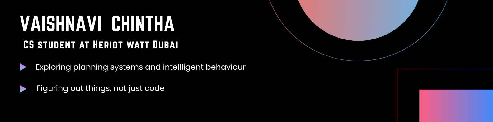

<h3 align="center">
Hello, I'm <a href="https://github.com/Vaishnavi-chintha" target="_blank" rel="noreferrer">Vaishnavi</a> 👋
</h3>

A computer science student figuring out life and languages. Mostly just trying to make sense of things — in code and otherwise.

&nbsp;

 

  

- 🔭 I’m currently working on [Watt Home](https://github.com/Vaishnavi-chintha/Watt_Home)

- 🌱 I’m currently learning **AI, Planning systems, React**

- 💬 Ask me about **React, PDDL, Reinforcement algorithms**

- 📫 How to reach me **vaishnavichintha2812@gmail.com**

<h3 align="left">Languages and Tools:</h3>

          
 

 

 
   

<!-- 
  
 -->

